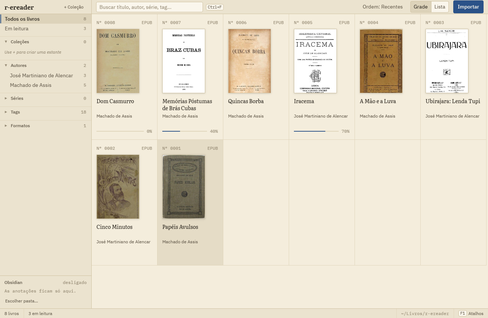
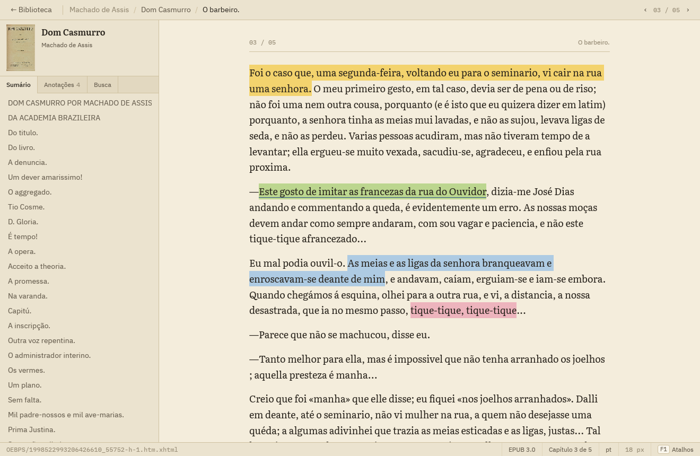

<p align="center">
  <picture>
    <source media="(prefers-color-scheme: dark)" srcset="docs/logo-dark.svg">
    
  </picture>
</p>

<p align="center">
  <strong>Leitor de ebooks e biblioteca pessoal, em Rust puro.</strong><br>
  Parser de EPUB próprio, interface em <a href="https://gpui.rs">GPUI</a> (o framework do Zed),
  papel sépia e tudo navegável pelo teclado.
</p>

<p align="center">
  
  
  
</p>

<p align="center">
  
</p>

<p align="center">
  
</p>

<p align="center"><sub>Os livros das capturas são de domínio público, do <a href="https://www.gutenberg.org">Projeto Gutenberg</a>.</sub></p>

---

## O que ele faz

- **Biblioteca gerenciada, no estilo Calibre.** Importa EPUB e PDF (arrastando arquivos ou
  pastas), deduplica por hash, extrai metadados e capas e organiza tudo em `Autor/Título/`.
  Tem busca sem acentos, filtros por autor, série, tag e formato, coleções e edição de metadados.
- **Leitor de EPUB com parser próprio.** Lê container, OPF, spine e sumário (nav do EPUB 3 e
  NCX do EPUB 2) e guarda o progresso de cada livro.
- **Destaques em 4 cores, com notas.** Ficam numa aba de anotações e sobrevivem a mudanças
  na extração de texto.
- **Busca no livro inteiro.** Ignora maiúsculas, acentos e pontuação tipográfica; frase exata
  primeiro, palavras soltas depois.
- **Integração com o Obsidian.** Uma nota por livro, sincronizada a cada destaque, sem
  tocar no que você escreveu.
- **Teclado em primeiro lugar.** `Tab` entre painéis, setas nas listas e na grade, e `F1`
  mostra todos os atalhos da tela atual.

## Rodando

Dependências de sistema no Ubuntu/Debian:

```sh
sudo apt install libxkbcommon-x11-dev libxkbcommon-dev libfreetype-dev libfontconfig-dev libvulkan1
```

```sh
cargo run -p r-ereader                          # abre a biblioteca
cargo run -p r-ereader -- ~/Livros/livro.epub   # abre um EPUB direto no leitor, sem importar
                                                # (se já estiver na biblioteca, usa progresso e destaques)
```

A biblioteca fica em `~/Livros/r-ereader` (ou em `$R_EREADER_LIBRARY`): um `metadata.db` (SQLite)
e os arquivos organizados em `Autor/Título (id)/`, com `cover.jpg` e `thumb.jpg`.

> A primeira compilação demora alguns minutos (o GPUI é grande e é otimizado mesmo no build de
> debug). As seguintes levam segundos.

## Atalhos

`F1` (ou `Ctrl+/`) abre a folha com todos os atalhos da tela atual. Dá para fazer tudo sem
mouse, menos selecionar um trecho para destacar.

<details open>
<summary><strong>Biblioteca</strong></summary>

| Atalho | Ação |
|---|---|
| `Tab` / `Shift+Tab` | Passa entre navegador, busca e livros |
| setas, `Home` `End`, `PgUp` `PgDn` | Escolhe um livro (no navegador: um filtro; `←` `→` fecham e abrem seções) |
| `Enter` | Abre o livro (no navegador: aplica o filtro) |
| `F2` | Edita os metadados |
| `Del` duas vezes | Exclui o livro |
| `Ctrl+F` | Busca; `Enter` leva aos resultados |
| `Ctrl+1` / `Ctrl+2` | Grade / lista |
| `Ctrl+O` | Importa livros (também dá para arrastar arquivos ou pastas) |
| `Esc` | Cancela a edição / tira a seleção |

</details>

<details>
<summary><strong>Leitor</strong></summary>

| Atalho | Ação |
|---|---|
| `←` `→` | Capítulo anterior / próximo |
| `↑` `↓`, `PgUp` `PgDn` `Espaço`, `Home` `End` | Rola o texto |
| `Ctrl+=` / `Ctrl+-` / `Ctrl+0` | Aumenta / diminui / restaura o tamanho do texto (fica salvo) |
| `Ctrl+B` | Mostra / esconde a lateral |
| `Ctrl+1` `Ctrl+2` `Ctrl+3` | Sumário / anotações / busca, com `↑` `↓` `Enter` na lista e `Esc` de volta ao texto |
| arrastar / duplo clique | Seleciona trecho / palavra (abre o menu de cores) |
| clique num destaque | Troca a cor, edita a nota, copia, remove |
| `Ctrl+C` | Copia a seleção |
| `Ctrl+F` | Busca no livro (uma seleção curta vira a busca) |
| `Enter` / `F3` / `Ctrl+G` | Próximo resultado (`Shift+F3` / `Ctrl+Shift+G`: anterior) |
| `Esc` | Fecha nota → menu/seleção → limpa a busca → volta à biblioteca (o progresso é salvo) |

</details>

<details>
<summary><strong>Em qualquer lugar</strong></summary>

| Atalho | Ação |
|---|---|
| `F1` / `Ctrl+/` | Folha de atalhos |
| `Enter` / `Esc` / `Tab` (formulários) | Salva / cancela / próximo campo |
| `Ctrl+Q` | Sai |

</details>

## Visual

A ideia é um **fichário**: papel sépia, painéis separados por pautas de 1 px (no espírito do
Zed), cantos quase retos e números em mono. A grade de livros é uma gaveta de fichas, cada uma
com seu número de catálogo, e o painel de detalhes é a ficha pautada. O azul de caneta
(`#2b5288`) marca o que está ativo e o cursor do teclado.

As fontes vão embutidas no binário (`crates/app/assets/fonts`, licença OFL):
**IBM Plex Sans** na interface, **IBM Plex Mono** nos números e **Literata** no texto dos livros.

## Obsidian

Os destaques viram uma nota por livro no vault do Obsidian, atualizada automaticamente a cada
destaque criado, editado ou removido (e o progresso, ao fechar o leitor).

- Na primeira execução a pasta é `<vault aberto no Obsidian>/Leituras`. Dá para trocar, exportar
  tudo ou desativar na seção **Obsidian** da barra lateral da biblioteca.
- A nota tem propriedades (`titulo`, `autores` como `[[wikilinks]]`, `serie`, `isbn`, `progresso`…),
  os destaques agrupados por capítulo em callouts `> [!quote|cor]` e âncoras `^rr-<id>` para citar
  um destaque em outra nota: `[[Livro — Autor#^rr-12]]`.
- Só o trecho entre `%% r-ereader:inicio %%` e `%% r-ereader:fim %%` e as propriedades do
  r-ereader são reescritos. Texto e propriedades seus ficam; as tags só são escritas na criação
  da nota.
- A nota é reencontrada pela propriedade `r_ereader_id`, então pode ser renomeada ou movida
  dentro da pasta. Excluir o livro da biblioteca não apaga a nota.
- As cores dos callouts vêm do snippet `.obsidian/snippets/r-ereader-destaques.css`, criado uma
  vez; ative em *Configurações → Aparência → Trechos de CSS*.

```sh
cargo run -p r-ereader-library --example obsidian -- ~/Livros/r-ereader "<vault>/Leituras"
```

## Busca no livro

Na primeira busca o livro inteiro é indexado em segundo plano (`crates/app/src/search.rs`).
A comparação ignora maiúsculas, acentos, aspas/apóstrofos/travessões tipográficos e espaços
repetidos: `nao` acha "Não", `d'avila` acha "d’Ávila". Com várias palavras, os parágrafos com a
frase exata vêm primeiro; depois, os que têm todas as palavras fora de ordem. O primeiro `Enter`
vai ao resultado mais próximo a partir do capítulo atual.

## Estrutura

| Crate | Papel |
|---|---|
| `crates/epub` (`r-ereader-epub`) | Container, OPF (metadados, série, ISBN, manifest, spine), sumário (nav do EPUB 3 e NCX do EPUB 2), DOM XML própria |
| `crates/library` (`r-ereader-library`) | Biblioteca gerenciada: importação com deduplicação por hash, metadados de EPUB e PDF, capas, busca FTS5 sem acentos, coleções, edição (move a pasta), progresso, destaques com notas |
| `crates/app` (`r-ereader`) | Interface GPUI: biblioteca (navegador lateral, grade/lista, detalhes, edição) e leitor |

## Testes

```sh
cargo test -p r-ereader-epub -p r-ereader-library
cargo test -p r-ereader      # testes de interface headless (TestAppContext do GPUI)
```

Ferramentas de diagnóstico do crate `epub`:

```sh
cargo run -p r-ereader-epub --example inspect -- livro.epub     # metadados + sumário
cargo run -p r-ereader-epub --example check_all -- *.epub       # parse de todos os capítulos
```

## Roteiro

- [x] `epub`: container, OPF, spine, sumário
- [x] `library` + hub: importação, busca, filtros, edição, coleções, progresso
- [x] Destaques em 4 cores com notas e aba de anotações; exportação para o Obsidian
- [x] Busca no livro inteiro, sem acentos/maiúsculas, com frase exata e palavras separadas
- [x] Interface "fichário" e navegação completa pelo teclado
- [ ] `doc` + `layout`: árvore de documento semântica, quebra de linha e paginação próprias,
      com o shaping de texto do GPUI por trás de uma trait
- [ ] `style`: subconjunto de CSS (seletores, cascata, herança) + CSS do usuário
- [ ] Imagens no fluxo, hifenização, temas
- [ ] Capa de PDF (renderizar a 1ª página) e leitor de PDF
- [ ] Importar biblioteca do Calibre

A área de leitura atual (`crates/app/src/preview.rs`) é provisória: extrai blocos de texto
sem CSS só para enxergar o conteúdo até o motor de layout existir.

## Notas técnicas

- Destaques guardam o capítulo, o intervalo no texto do capítulo e o trecho citado. Se a extração
  de texto mudar (por exemplo, quando o motor de layout próprio substituir o atual), o trecho é
  reencontrado pela citação e a posição nova é gravada (`r_ereader_library::anchor`).
- `patches/xattr`: o `xattr` 0.2.3, puxado pelo GPUI, não compila com `libc` >= 0.2.190
  (o `ENOATTR` foi removido no Linux). O patch local troca pelo `ENODATA` equivalente.
- Bibliotecas de antes da troca de nome (`~/Livros/rereader`) são movidas para
  `~/Livros/r-ereader` na primeira execução, e notas antigas do Obsidian continuam sendo
  reconhecidas.

## Licença

Código sob MIT. As fontes embutidas (IBM Plex e Literata) são distribuídas sob a SIL Open Font
License; os textos das licenças estão em `crates/app/assets/fonts`.
